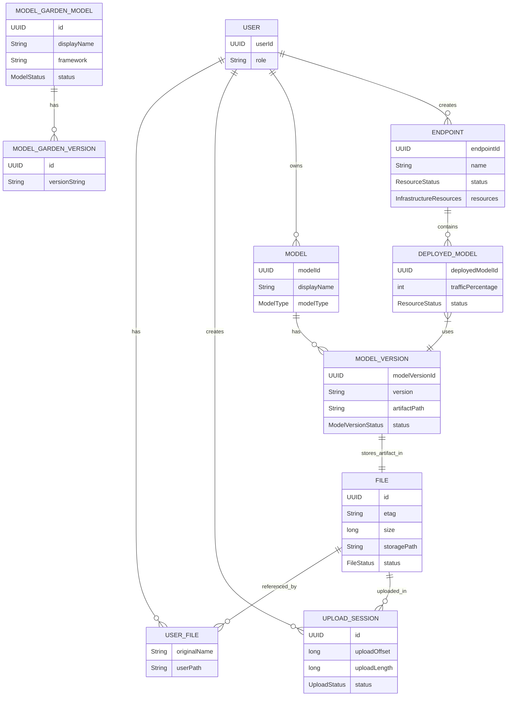
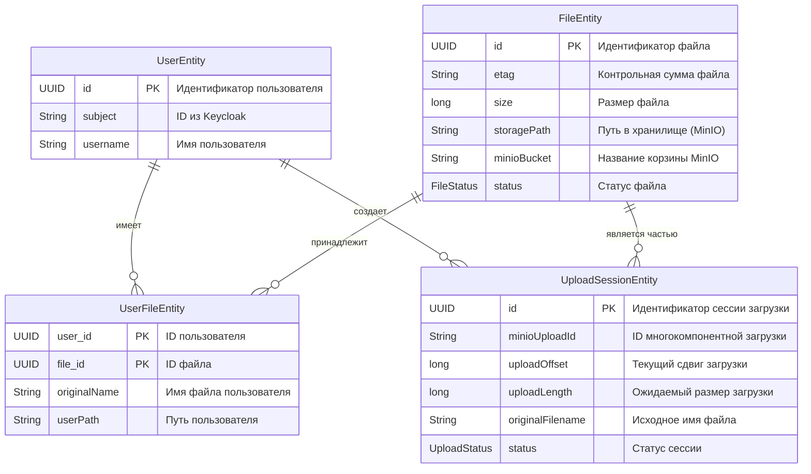
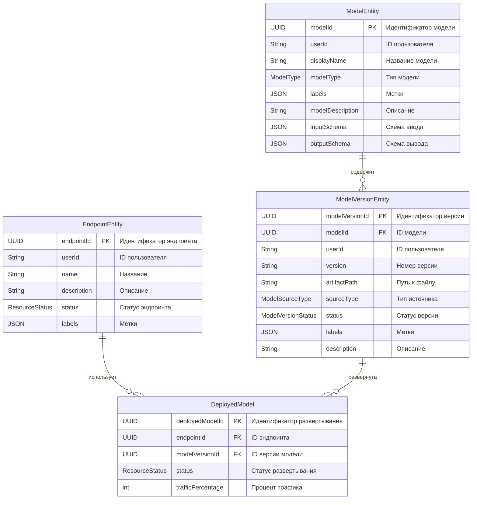
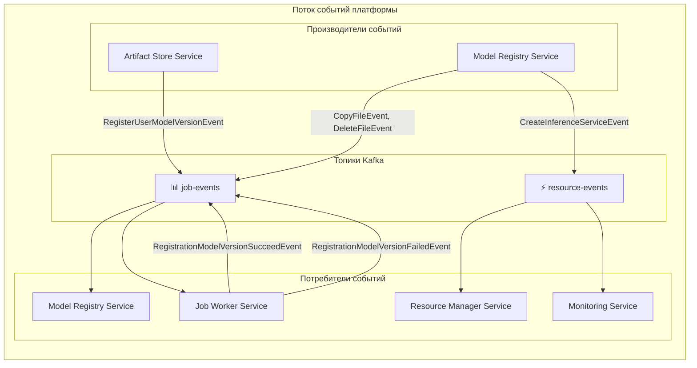

### **4. Структурный взгляд на систему (Building Block View)**

Данный раздел описывает статическую структуру системы через основные компоненты (строительные блоки), ключевые сущности данных и их взаимосвязи.

#### **4.1. Высокоуровневая диаграмма компонентов**

На следующей диаграмме показаны ключевые микросервисы (строительные блоки) платформы и их взаимодействие.

![[Building Block Diagram.png]]

#### **4.2. Диаграмма сущностей (Entity Relationship Diagram)**

##### 4.2.1. Общая диаграмма сущностей

На следующей диаграмме показаны ключевые сущности системы и их взаимосвязи:

##### 4.2.2. Модель данных для Artifact Store

Этот сервис отвечает за управление файлами моделей и других артефактов. Его основная цель — надёжное и эффективное хранение.

  * **`UserEntity`**: Хранит основные данные о пользователе. Связь с `Keycloak` через поле `subject`.
  * **`FileEntity`**: Содержит метаданные о файле, такие как его физическое расположение, размер и статус. Это позволяет хранить один и тот же файл для нескольких пользователей, не дублируя его.
  * **`UploadSessionEntity`**: Используется для управления процессом загрузки файлов. Эта сущность делает возможным возобновление загрузки, что очень важно для больших файлов.
  * **`UserFileEntity`**: Связующая таблица между пользователями и файлами. Она позволяет одному файлу иметь несколько владельцев и хранит уникальные для каждого пользователя метаданные, такие как оригинальное имя файла.

##### 4.2.3. Модель данных для Model Registry

Этот сервис управляет жизненным циклом моделей, их версиями и развертыванием.

  * **`ModelEntity`**: Представляет логическую модель. Она объединяет все версии одной модели.
  * **`ModelVersionEntity`**: Хранит метаданные каждой конкретной версии модели. Именно эта сущность привязана к физическому файлу (`artifactPath`).
  * **`EndpointEntity`**: Определяет эндпоинт, который служит точкой входа для инференс-запросов. Он содержит информацию о выделенных ресурсах.
  * **`DeployedModel`**: Связующая таблица, которая позволяет привязать одну или несколько версий модели к одному эндпоинту. Это делает возможными сценарии вроде **канареечных релизов**, когда трафик распределяется между разными версиями.

#### **4.3. Диаграмма потока событий (Event Flow Diagram)**

На следующей диаграмме показаны ключевые события системы и их поток между компонентами:

#### **4.4. Описание строительных блоков (Компонентов)**

##### 4.4.1. Model Garden Service (Java)

**Выбранное Решение:** Предоставляет каталог готовых к использованию ML-моделей. Решает задачи discovery (поиск, фильтрация, просмотр метаданных) и потребления ("клонирование" модели в личный реестр пользователя).

 **Ключевые интерфейсы:**
* **REST API:** Для фронтенда и пользователей.
* **Kafka:** Публикует события (например, `ModelPublishedEvent`) и потребляет события от других сервисов.
* **Model Registry Service:** Вызывает его REST API для операции "клонирования" модели.
* **Keycloak:** Для аутентификации и авторизации запросов.

**Основные сущности (Entity):**
* `ModelGardenModel`: Агрегат, представляющий модель в каталоге. Содержит метаданные (`displayName`, `framework`, `taskType`, `publisher`, `license`, `artifactPath`), статус (`ModelStatus`: DRAFT, PUBLISHED, DEPRECATED, ARCHIVED) и версии.
* `ModelGardenVersion`: Объект значения, представляющий конкретную версию опубликованной модели.

##### 4.4.2. Model Registry Service (Java)

**Выбранное Решение:** Управляет личным реестром моделей пользователя. Является центральным координатором жизненного цикла модели: регистрация, версионирование, развертывание.

**Ключевые интерфейсы:**
* **REST API:** Для фронтенда и внутренних сервисов.
* **Artifact Store Service:** Вызывает его API для инициализации загрузки артефактов.
* **Resource Manager Service:** Вызывает его API для развертывания зарегистрированной модели.
* **Kafka:** Публикует события о изменениях в моделях (например, `RegisterUserModelVersionEvent`, `DeleteModelVersionEvent`) и потребляет события от Jobs.
* **Kubernetes API:** Создает Jobs для копирования артефактов моделей.
* **Keycloak:** Для аутентификации и авторизации.

**Основные сущности (Entity):**
* `ModelEntity`: Агрегат, представляющий модель пользователя. Содержит `modelId`, `userId`, `modelType`, `displayName`, `inputSchema`, `outputSchema`.
* `ModelVersionEntity`: Агрегат, представляющий версию модели. Ключевая сущность, связывающая `ModelEntity` с артефактом в S3 (`artifactPath`). Имеет статус (`ModelVersionStatus`: PENDING, REGISTERED, FAILED).
* `EndpointEntity`: Агрегат, представляющий эндпоинт для обслуживания трафика. Содержит конфигурацию ресурсов (`InfrastructureResources`: `cpu`, `memory`, `gpu`).
* `DeployedModel`: Объект значения, связывающий `EndpointEntity` с `ModelVersionEntity` и определяющий `trafficPercentage`.

##### 4.4.3. Artifact Store Service (Java)

**Выбранное Решение:** Управляет жизненным циклом нефункциональных артефактов (датасеты, файлы моделей, логи). Генерирует безопасные URL для прямой загрузки/выгрузки файлов из S3, обеспечивая контроль доступа и поддерживая возобновляемую загрузку.
 
**Ключевые интерфейсы:**
* **REST API:** Предоставляет эндпоинты для инициализации загрузки.
* **S3 API:** Напрямую взаимодействует с S3-хранилищем для управления объектами.
* **Kafka:** Публикует события о завершении загрузки (например, `ArtifactUploadedEvent`).

**Основные сущности (Entity):**
* `UserEntity`: Представление пользователя системы.
* `FileEntity`: Представляет загруженный файл. Содержит `size`, `etag`, `storagePath`, `status` (`FileStatus`: PENDING, VERIFIED, INFECTED, DELETED).
* `UploadSessionEntity`: Управляет сессией многопартовой загрузки. Содержит `uploadOffset`, `uploadLength`, `partEtags`.
* `UserFileEntity`: Связывает `UserEntity` с `FileEntity`, добавляя метаданные уровня пользователя (`originalName`, `userPath`).

##### 4.4.4. Resource Manager Service (Java)

**Выбранное Решение:** Управляет развертыванием моделей в виде инференс-сервисов. Преобразует запросы на деплой в специфичные для рантайма (например, NVIDIA Triton) Kubernetes-манифесты (InferenceService) и отслеживает их состояние.

**Ключевые интерфейсы:**
* **REST API:** Для внутренних сервисов (Model Registry).
* **Kubernetes API:** Для создания, обновления и удаления ресурсов (Deployments, Services, InferenceService).
* **Kafka:** Публикует события о состоянии ресурсов (`ServingResourceCreated`, `ServingResourceUpdated`) и потребляет команды.
* **Keycloak:** Для аутентификации и авторизации.
**Основные Data Transfer Objects (DTOs):**
* `InferenceParameters`: Параметры для создания сервиса инференса (`modelName`, `modelFormat`, `artifactPath`).
* `TritonRuntimeParameters`: Параметры для рантайма Triton.
* `TritonConfigParameters`: Конфигурация модели для Triton (`maxBatchSize`, `input/output` schema).

#### **4.5. Система событий (Event System)**

Взаимодействие между микросервисами построено на асинхронной коммуникации через события в Apache Kafka.

##### 4.5.1. События заданий (Job Events)

Оркестрируют длительные фоновые процессы (копирование файлов, регистрация моделей).
* `RegisterUserModelVersionEvent`: Запрос на регистрацию новой версии модели (запускает Job копирования в S3).
* `RegistrationModelVersionSucceedEvent` / `RegistrationModelVersionFailedEvent`: Результат регистрации.
* `CopyFileEvent`: Команда на копирование файла между бакетами S3.
* `DeleteFileEvent`: Команда на удаление файла из S3.

##### 4.5.2. События ресурсов (Serving Resource Events)

Отражают состояние ресурсов в Kubernetes (эндпоинты, сервисы инференса).
* `CreateRuntimeEvent`: Запрос на создание рантайма (e.g., Triton) для эндпоинта.
* `CreateInferenceServiceEvent`: Запрос на развертывание конкретной версии модели в рантайме.
* `ServingResourceCreated` / `ServingResourceUpdated` / `ServingResourceDeleted`: События о изменении состояния ресурса.

##### 4.5.3. Базовая структура событий
Все события наследуются от `BaseEvent` (содержит `eventId`, `timestamp`, `eventType`) и передают контекст выполнения через объекты `JobInfo` или `ServingResourceInfo`.

