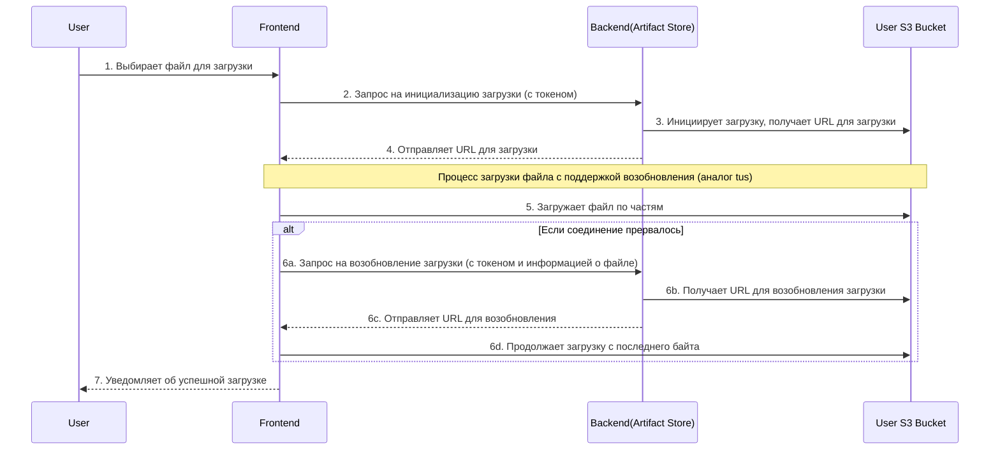
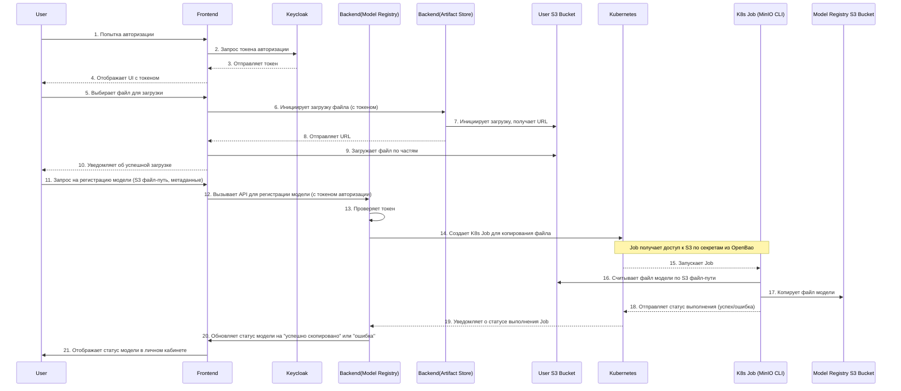
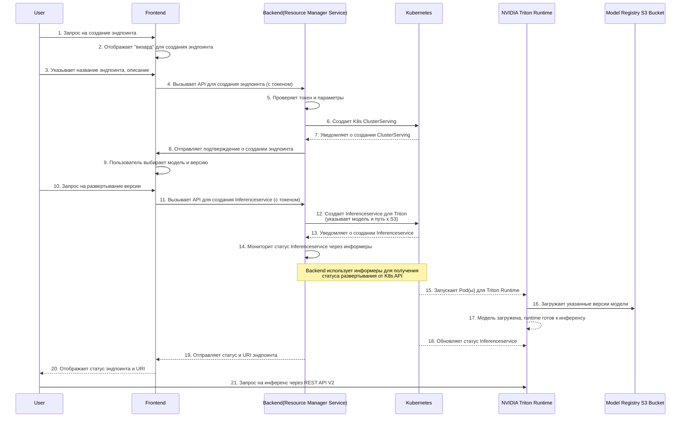
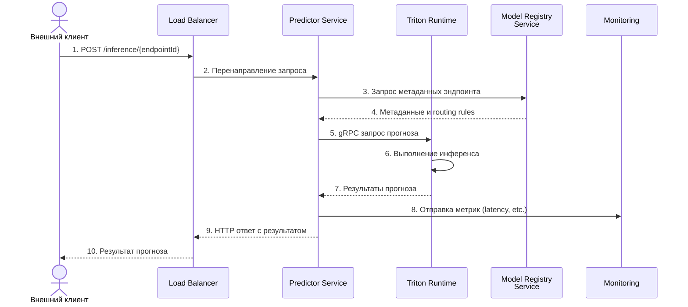
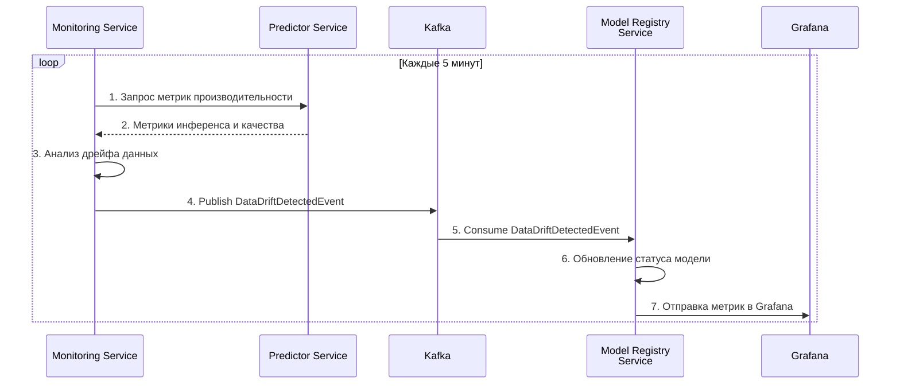

### **5. Взаимодействие между компонентами (Runtime View)**

Данный раздел описывает ключевые сценарии взаимодействия компонентов системы во время выполнения. Основное внимание уделяется процессам, которые демонстрируют архитектурно значимые аспекты системы.

#### 5.1. Сценарий: Загрузка файла с возобновлением

**Описание шагов:**
1.  **Пользователь** (`User`) ->> **Фронтенд** (`Frontend`): Пользователь выбирает файл на своём компьютере, который он хочет загрузить в систему.
2.  **Фронтенд** ->> **Бэкенд (Artifact Store)**: Фронтенд отправляет запрос в микросервис **Artifact Store**, чтобы инициировать новую сессию загрузки. Этот запрос содержит информацию о файле (имя, размер) и токен авторизации пользователя.
3.  **Бэкенд (Artifact Store)** ->> **Хранилище пользователя (User S3 Bucket)**: Сервис **Artifact Store** взаимодействует с S3-хранилищем пользователя. Он создаёт специальный "промежуточный" файл и получает уникальный **URL для загрузки**, который будет использоваться для передачи данных.
4.  **Бэкенд (Artifact Store)** -->> **Фронтенд**: Сервис **Artifact Store** возвращает этот уникальный URL на фронтенд.
5.  **Фронтенд** ->> **Хранилище пользователя (User S3 Bucket)**: Теперь фронтенд начинает загружать файл напрямую в S3, используя полученный URL. Загрузка происходит **по частям**, что является основой для возможности возобновления.
6.  **Альтернативный сценарий (разрыв соединения):** Если по какой-либо причине (например, обрыв интернет-связи) загрузка прерывается, фронтенд не теряет прогресс. Вместо этого он может снова обратиться к **Artifact Store** с запросом на возобновление загрузки, предоставляя информацию о файле и последний успешно загруженный байт.
7.  **Фронтенд** ->> **Хранилище пользователя (User S3 Bucket)**: Получив новый URL, фронтенд продолжает загрузку ровно с того места, где она прервалась, без необходимости начинать всё сначала. Это очень удобно для больших файлов.
8.  **Фронтенд** -->> **Пользователь**: Когда все части файла успешно загружены, фронтенд уведомляет об этом пользователя, и он может переходить к следующему этапу — регистрации модели.

#### 5.2. Сценарий: Регистрация новой версии модели

**Описание шагов:**
**Часть 1: Аутентификация и авторизация**
* **Шаг 1-2:** **Пользователь** пытается войти в систему. **Фронтенд** перенаправляет его в **Keycloak** для получения токена.
* **Шаг 3-4:** **Keycloak** аутентифицирует пользователя и возвращает токен. **Фронтенд** сохраняет этот токен и показывает пользовательский интерфейс.
**Часть 2: Загрузка файла модели**
* **Шаг 5-6:** **Пользователь** выбирает файл для загрузки. **Фронтенд** отправляет запрос в микросервис **Artifact Store**, чтобы инициировать загрузку. В этом запросе передаётся токен, который подтверждает, что пользователь имеет право на загрузку.
* **Шаг 7-8:** **Artifact Store** взаимодействует с S3-хранилищем пользователя, получает URL для загрузки и отправляет его на **фронтенд**. Это позволяет фронтенду загружать файл напрямую в S3, обходя бэкенд.
* **Шаг 9:** **Фронтенд** начинает загружать файл по частям. Это важно для поддержки возобновления, если соединение прервётся.
* **Шаг 10:** После завершения загрузки **фронтенд** уведомляет **пользователя**.
**Часть 3: Регистрация модели в реестре**
* **Шаг 11-13:** **Пользователь** отправляет запрос на регистрацию модели, указывая путь к S3-файлу и метаданные. **Фронтенд** передаёт этот запрос в микросервис **Model Registry**. **Model Registry** проверяет токен и подтверждает права пользователя.
* **Шаг 14-15:** **Model Registry** создаёт **Kubernetes Job**. Этот Job отвечает за копирование файла. Job получает доступ к S3 по секретам, хранящимся в **OpenBao**.
* **Шаг 16-17:** Запущенный **K8s Job** считывает файл из S3-хранилища пользователя и копирует его в S3-хранилище реестра моделей.
* **Шаг 18-19:** После завершения операции **K8s Job** отправляет статус в **Kubernetes**, который, в свою очередь, уведомляет об этом **Model Registry**.
* **Шаг 20-21:** **Model Registry** обновляет статус модели (успешно скопирована или ошибка) и отправляет его на **фронтенд**, где он отображается в личном кабинете пользователя.

#### **5.3. Сценарий: Развертывание модели в эндпоинт**

**Компоненты:**
1.  **Пользователь** (`User`): Инициирует процесс развёртывания.
2.  **Фронтенд** (`Frontend`): Веб-интерфейс, через который пользователь выбирает модель и настраивает эндпоинт.
3.  **Бэкенд (Model Registry)** (`Backend (Model Registry)`): Сервис, который управляет регистрацией моделей и их версий.
4.  **Бэкенд (Deployment Service)** (`Backend (Resource Manager Service)`): Компонент, который отвечает за создание и управление эндпоинтами.
5.  **Kubernetes** (`Kubernetes`): Управляет развёртыванием рантайм-сервисов.
6.  **NVIDIA Triton Runtime** (`NVIDIA Triton Runtime`): Сам сервис рантайма, который будет определять инференс.
7.  **Хранилище моделей** (`Model Registry S3 Bucket`): Хранилище, где лежат зарегистрированные версии моделей.

**Описание шагов:**
1.  **Пользователь** (`User`) ->> **Фронтенд** (`Frontend`): Пользователь инициирует процесс, отправляя запрос на создание эндпоинта.
2.  **Фронтенд** ->> **Фронтенд**: Фронтенд-приложение отображает для пользователя специальный интерфейс ("визард"), чтобы упростить процесс.
3.  **Пользователь** ->> **Фронтенд**: Пользователь заполняет необходимые поля, такие как название и описание эндпоинта, и отправляет данные.
4.  **Фронтенд** ->> **Бэкенд (Resource Manager Service)**: Фронтенд вызывает **API** бэкенда для создания эндпоинта, передавая токен авторизации и информацию, которую заполнил пользователь.
5.  **Бэкенд (Resource Manager Service)** ->> **Бэкенд (Resource Manager Service)**: Сервис-менеджер ресурсов проверяет токен и все параметры, чтобы убедиться, что они корректны.
6.  **Бэкенд (Resource Manager Service)** ->> **Kubernetes**: Сервис-менеджер ресурсов отправляет команду в Kubernetes на создание объекта `K8s ClusterServing`. Это просто "пустой" эндпоинт, который ещё не готов к работе.
7.  **Kubernetes** -->> **Бэкенд (Resource Manager Service)**: Kubernetes подтверждает, что объект `ClusterServing` успешно создан.
8.  **Бэкенд (Resource Manager Service)** ->> **Фронтенд**: Бэкенд отправляет на фронтенд подтверждение, что эндпоинт создан.
9.  **Фронтенд** ->> **Фронтенд**: Фронтенд-приложение показывает пользователю, что эндпоинт создан, и предлагает выбрать модель и её версию для развёртывания.
10. **Пользователь** ->> **Фронтенд**: Пользователь выбирает конкретную модель и версию, которую он хочет развернуть, и отправляет запрос.
11. **Фронтенд** ->> **Бэкенд (Resource Manager Service)**: Фронтенд снова вызывает API бэкенда, но уже для создания `Inferenceservice`, передавая информацию о выбранной модели и версии.
12. **Бэкенд (Resource Manager Service)** ->> **Kubernetes**: Сервис-менеджер ресурсов создаёт объект `Inferenceservice` в Kubernetes. Этот объект уже содержит ссылку на модель, которую нужно развернуть, и указывает, что для этого будет использоваться **Triton**.
13. **Kubernetes** -->> **Бэкенд (Resource Manager Service)**: Kubernetes подтверждает, что `Inferenceservice` создан.
14. **Бэкенд (Resource Manager Service)** ->> **Бэкенд (Resource Manager Service)**: Это важный шаг. Сервис-менеджер ресурсов не ждёт ответа, а **мониторит** состояние `Inferenceservice` в Kubernetes, используя **информеры**. Это позволяет ему получать актуальную информацию о статусе развёртывания в реальном времени.
15. **Kubernetes** -->> **NVIDIA Triton Runtime**: Kubernetes, основываясь на объекте `Inferenceservice`, запускает один или несколько подов с рантаймом **NVIDIA Triton**.
16. **NVIDIA Triton Runtime** ->> **Хранилище моделей**: Запущенный сервис **Triton** обращается в хранилище моделей (Model Registry S3 Bucket) и загружает указанные версии модели.
17. **NVIDIA Triton Runtime** -->> **NVIDIA Triton Runtime**: После загрузки модели сервис **Triton** готов к работе.
18. **Kubernetes** -->> **NVIDIA Triton Runtime**: Kubernetes обновляет статус `Inferenceservice`, когда рантайм готов к приёму запросов.
19. **Бэкенд (Resource Manager Service)** -->> **Фронтенд**: Получив информацию о готовности от Kubernetes, сервис-менеджер ресурсов отправляет на фронтенд финальный статус и URI эндпоинта.
20. **Фронтенд** -->> **Пользователь**: Фронтенд отображает пользователю, что эндпоинт готов, и предоставляет **URI**, который можно использовать для запросов.
21. **Пользователь** ->> **NVIDIA Triton Runtime**: Теперь пользователь может отправлять запросы на **инференс** напрямую в развёрнутую модель, используя предоставленный URI.

#### **5.4. Сценарий: Обслуживание прогнозов (Inference)**

**Описание шагов:**
1. Внешний клиент отправляет запрос на инференс
2. Load Balancer перенаправляет запрос в Predictor Service
3. Predictor запрашивает актуальные метаданные эндпоинта
4. Model Registry возвращает метаданные и правила маршрутизации
5. Predictor отправляет gRPC запрос в Triton Runtime
6. Triton выполняет инференс на GPU/CPU
7. Triton возвращает результаты прогноза
8. Predictor отправляет метрики в систему мониторинга
9. Predictor возвращает HTTP ответ с результатами
10. Клиент получает результаты прогноза

#### **5.5. Сценарий: Мониторинг состояния моделей**

Этот сценарий описывает процесс мониторинга и обнаружения дрейфа данных.

**Описание шагов:**
1. Monitoring Service периодически запрашивает метрики
2. Predictor возвращает метрики производительности и качества
3. Monitoring Service анализирует метрики на предмет дрейфа
4. При обнаружении дрейфа публикуется соответствующее событие
5. Model Registry потребляет событие дрейфа
6. Model Registry обновляет статус модели (например, "DEGRADED")
7. Метрики визуализируются в Grafana для анализа
