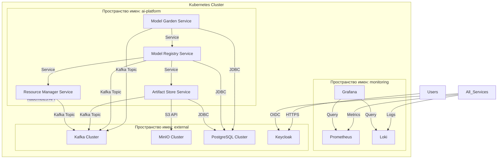

### **6. Развертывание и эксплуатация**

Данный раздел описывает требования к инфраструктуре, процесс развертывания системы, а также аспекты её эксплуатации и мониторинга.

#### **6.1. Требования к инфраструктуре**

Система развертывается on-premise на выделенном кластере Kubernetes. Ниже приведены минимальные и рекомендуемые требования.

**6.1.1. Kubernetes Cluster**
*   **Версия Kubernetes:** 1.24+
*   **Ноды:**
    *   **Control Plane:** 3 ноды (высокая доступность)
    *   **Worker Ноды:** 5+ нод (возможность горизонтального масштабирования)
    *   **Операционная система:** CentOS 8+
*   **Сеть:**
    *   **CNI Plugin:** Calico или Cilium
    *   **LoadBalancer:** MetalLB или эквивалент для on-premise
    *   **Ingress Controller:** NGINX Ingress Controller
*   **Хранилище:**
    *   **Storage Class:** SSD-based (например, Rook-Ceph или внешнее SDS-решение)
    *   **Объем:** 10+ ТБ для хранения артефактов моделей и данных

**6.1.2. Внешние зависимости**
Платформа зависит от следующих внешних систем, которые должны быть развернуты и настроены до установки:
*   **Keycloak:** 2+ ноды (HA режим)
*   **Apache Kafka:** 3+ ноды (ZooKeeper ensemble)
*   **MinIO (S3-совместимое хранилище):** 4+ ноды (分布式模式)
*   **PostgreSQL:** 3+ ноды (кластер с репликацией)

#### **6.2. Архитектура развертывания**



#### **6.3. Процесс развертывания**

Развертывание осуществляется с использованием GitOps-подхода с Flux CD.

**6.3.1. Предварительные требования**
1. Установить и настроить Flux CD в кластере
2. Создать Git-репозиторий с конфигурацией окружения
3. Настроить секреты (Secrets) для доступа к внешним системам

**6.3.2. Последовательность развертывания**
1. **Развертывание внешних зависимостей:**
   ```bash
   flux create source git external-deps --url=https://github.com/company/gitops-external
   flux create kustomization external-deps --source=external-deps --path="./envs/production"
   ```

2. **Развертывание мониторинга:**
   ```bash
   flux create source git monitoring --url=https://github.com/company/gitops-monitoring
   flux create kustomization monitoring --source=monitoring --path="./envs/production"
   ```

3. **Развертывание AI Platform:**
   ```bash
   flux create source git ai-platform --url=https://github.com/company/gitops-ai-platform
   flux create kustomization ai-platform --source=ai-platform --path="./envs/production"
   ```

**6.3.3. Конфигурация Helm-чартов**
Каждый сервис платформы развертывается как отдельный Helm-чарт с следующими общими параметрами:
```yaml
# values-prod.yaml
replicaCount: 3
resources:
  requests:
    cpu: 500m
    memory: 1Gi
  limits:
    cpu: 2
    memory: 4Gi

autoscaling:
  enabled: true
  minReplicas: 3
  maxReplicas: 10
  targetCPUUtilizationPercentage: 80

java:
  jvmOptions: "-XX:MaxRAMPercentage=75.0 -XX:+UseG1GC"

serviceAccount:
  create: true
  annotations:
    eks.amazonaws.com/role-arn: arn:aws:iam::account-id:role/ai-platform-role

config:
  kafka:
    bootstrapServers: "kafka-cluster:9092"
  database:
    url: "jdbc:postgresql://postgres-cluster:5432/ai_platform"
  s3:
    endpoint: "https://minio-cluster"
    region: "us-east-1"
```

#### **6.4. Мониторинг и наблюдаемость**

**6.4.1. Метрики**
Каждый сервис экспортирует метрики в формате Prometheus:
* **HTTP-метрики:** Запросы/ответы, ошибки, latency
* **Бизнес-метрики:** Количество моделей, эндпоинтов, активных развертываний
* **Системные метрики:** Использование CPU/Memory, GC-паузы

**6.4.2. Дашборды Grafana**
Созданы стандартные дашборды для наблюдения за системой:
* **Обзор платформы:** Количество пользователей, моделей, эндпоинтов
* **Производительность API:** Latency, error rate, RPS
* **Состояние Kafka:** Lag потребителей, throughput
* **Использование ресурсов:** CPU/Memory по сервисам

**6.4.3. Логирование**
* Все сервисы пишут логи в stdout в формате JSON
* Loki собирает и индексирует логи со всех подов
* Настроены алерты на критические ошибки

**6.4.4. Трейсинг**
* Используется OpenTelemetry для распределенного трейсинга
* Трейсы хранятся в Jaeger
* Настроена выборка трейсов (10% для продакшена)

#### **6.5. Резервное копирование и восстановление**

**6.5.1. Критические данные для бэкапа:**
1. **Базы данных PostgreSQL:** Каждые 4 часа
2. **S3-бакеты с артефактами:** Непрерывное реплицирование
3. **Конфигурация Kubernetes:** Git-репозиторий (автоматический бэкап)

**6.5.2. Процедура восстановления:**
1. Восстановить базы данных из последней резервной копии
2. Восстановить S3-бакеты из реплики
3. Применить конфигурацию из Git-репозитория через Flux
4. Проверить целостность данных и запустить тесты

#### **6.6. Масштабирование**

**6.6.1. Горизонтальное масштабирование:**
* Сервисы Stateless (все основные) масштабируются через HPA
* Kafka и базы данных масштабируются добавлением нод в кластер
* S3-хранилище масштабируется автоматически

**6.6.2. Вертикальное масштабирование:**
* Увеличение ресурсов для рабочих нод Kubernetes
* Настройка JVM-параметров для обработки больших моделей

#### **6.7. Процедуры обновления**

Обновления происходят по стратегии blue-green или canary:
1. Развернуть новую версию в отдельном пространстве имен
2. Направить часть трафика на новую версию
3. Мониторить метрики и логи на предмет ошибок
4. Постепенно перенести весь трафик
5. Удалить старую версию
