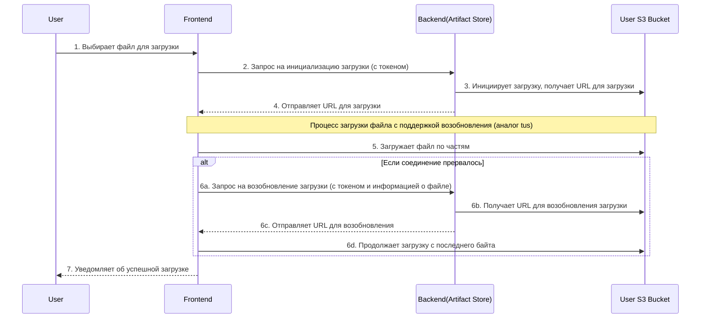

### **Диаграмма последовательности: Сценарий "Загрузка файла с возобновлением"**

Эта диаграмма показывает, как работает микросервис **Artifact Store** и его взаимодействие с фронтендом и хранилищем S3.

### **Описание шагов диаграммы

1.  **Пользователь** (`User`) ->> **Фронтенд** (`Frontend`): Пользователь выбирает файл на своём компьютере, который он хочет загрузить в систему.
2.  **Фронтенд** ->> **Бэкенд (Artifact Store)**: Фронтенд отправляет запрос в микросервис **Artifact Store**, чтобы инициировать новую сессию загрузки. Этот запрос содержит информацию о файле (имя, размер) и токен авторизации пользователя.
3.  **Бэкенд (Artifact Store)** ->> **Хранилище пользователя (User S3 Bucket)**: Сервис **Artifact Store** взаимодействует с S3-хранилищем пользователя. Он создаёт специальный "промежуточный" файл и получает уникальный **URL для загрузки**, который будет использоваться для передачи данных.
4.  **Бэкенд (Artifact Store)** -->> **Фронтенд**: Сервис **Artifact Store** возвращает этот уникальный URL на фронтенд.
5.  **Фронтенд** ->> **Хранилище пользователя (User S3 Bucket)**: Теперь фронтенд начинает загружать файл напрямую в S3, используя полученный URL. Загрузка происходит **по частям**, что является основой для возможности возобновления.
6.  **Альтернативный сценарий (разрыв соединения):** Если по какой-либо причине (например, обрыв интернет-связи) загрузка прерывается, фронтенд не теряет прогресс. Вместо этого он может снова обратиться к **Artifact Store** с запросом на возобновление загрузки, предоставляя информацию о файле и последний успешно загруженный байт.
7.  **Фронтенд** ->> **Хранилище пользователя (User S3 Bucket)**: Получив новый URL, фронтенд продолжает загрузку ровно с того места, где она прервалась, без необходимости начинать всё сначала. Это очень удобно для больших файлов.
8.  **Фронтенд** -->> **Пользователь**: Когда все части файла успешно загружены, фронтенд уведомляет об этом пользователя, и он может переходить к следующему этапу — регистрации модели.
