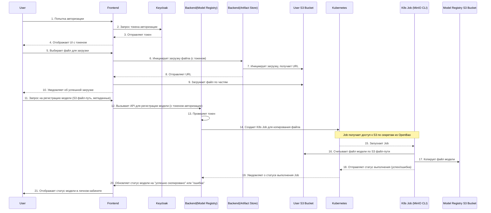

### Диаграмма последовательности Регистрация модели

### **Описание шагов диаграммы

Эта диаграмма описывает весь процесс — от входа пользователя в систему до успешной регистрации модели. Мы разделим его на три основные части, чтобы было удобнее следить за логикой.

#### **Часть 1: Аутентификация и авторизация**

* **Шаг 1-2:** **Пользователь** пытается войти в систему. **Фронтенд** перенаправляет его в **Keycloak** для получения токена.
* **Шаг 3-4:** **Keycloak** аутентифицирует пользователя и возвращает токен. **Фронтенд** сохраняет этот токен и показывает пользовательский интерфейс.

---

#### **Часть 2: Загрузка файла модели**

* **Шаг 5-6:** **Пользователь** выбирает файл для загрузки. **Фронтенд** отправляет запрос в микросервис **Artifact Store**, чтобы инициировать загрузку. В этом запросе передаётся токен, который подтверждает, что пользователь имеет право на загрузку.
* **Шаг 7-8:** **Artifact Store** взаимодействует с S3-хранилищем пользователя, получает URL для загрузки и отправляет его на **фронтенд**. Это позволяет фронтенду загружать файл напрямую в S3, обходя бэкенд.
* **Шаг 9:** **Фронтенд** начинает загружать файл по частям. Это важно для поддержки возобновления, если соединение прервётся.
* **Шаг 10:** После завершения загрузки **фронтенд** уведомляет **пользователя**.

---

#### **Часть 3: Регистрация модели в реестре**

* **Шаг 11-13:** **Пользователь** отправляет запрос на регистрацию модели, указывая путь к S3-файлу и метаданные. **Фронтенд** передаёт этот запрос в микросервис **Model Registry**. **Model Registry** проверяет токен и подтверждает права пользователя.
* **Шаг 14-15:** **Model Registry** создаёт **Kubernetes Job**. Этот Job отвечает за копирование файла. Job получает доступ к S3 по секретам, хранящимся в **OpenBao**.
* **Шаг 16-17:** Запущенный **K8s Job** считывает файл из S3-хранилища пользователя и копирует его в S3-хранилище реестра моделей.
* **Шаг 18-19:** После завершения операции **K8s Job** отправляет статус в **Kubernetes**, который, в свою очередь, уведомляет об этом **Model Registry**.
* **Шаг 20-21:** **Model Registry** обновляет статус модели (успешно скопирована или ошибка) и отправляет его на **фронтенд**, где он отображается в личном кабинете пользователя.
