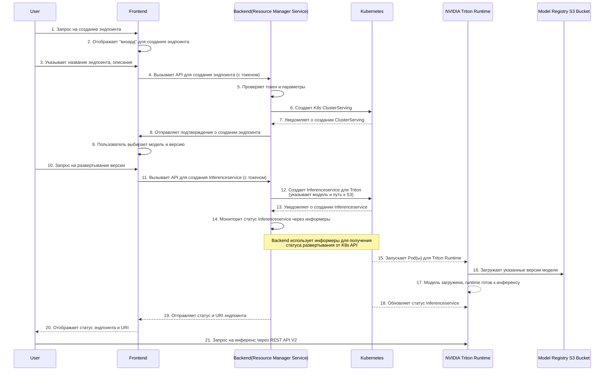

### **Описание решения**

Диаграмма последовательности будет включать следующие компоненты:

1.  **Пользователь** (`User`): Инициирует процесс развёртывания.
2.  **Фронтенд** (`Frontend`): Веб-интерфейс, через который пользователь выбирает модель и настраивает эндпоинт.
3.  **Бэкенд (Model Registry)** (`Backend (Model Registry)`): Сервис, который управляет регистрацией моделей и их версий.
4.  **Бэкенд (Deployment Service)** (`Backend (Resource Manager Service)`): Компонент, который отвечает за создание и управление эндпоинтами.
5.  **Kubernetes** (`Kubernetes`): Управляет развёртыванием рантайм-сервисов.
6.  **NVIDIA Triton Runtime** (`NVIDIA Triton Runtime`): Сам сервис рантайма, который будет определять инференс.
7.  **Хранилище моделей** (`Model Registry S3 Bucket`): Хранилище, где лежат зарегистрированные версии моделей.

-----

### **Код диаграммы последовательности (Mermaid)**

Вот код для твоей диаграммы. Ты можешь использовать его в онлайн-редакторе Mermaid для визуализации.

-----

### **Описание шагов диаграммы

Здесь мы рассмотрим каждый шаг, который происходит от момента, когда пользователь решает создать эндпоинт, до того, как этот эндпоинт готов принимать запросы на инференс.

1.  **Пользователь** (`User`) ->> **Фронтенд** (`Frontend`): Пользователь инициирует процесс, отправляя запрос на создание эндпоинта.
2.  **Фронтенд** ->> **Фронтенд**: Фронтенд-приложение отображает для пользователя специальный интерфейс ("визард"), чтобы упростить процесс.
3.  **Пользователь** ->> **Фронтенд**: Пользователь заполняет необходимые поля, такие как название и описание эндпоинта, и отправляет данные.
4.  **Фронтенд** ->> **Бэкенд (Resource Manager Service)**: Фронтенд вызывает **API** бэкенда для создания эндпоинта, передавая токен авторизации и информацию, которую заполнил пользователь.
5.  **Бэкенд (Resource Manager Service)** ->> **Бэкенд (Resource Manager Service)**: Сервис-менеджер ресурсов проверяет токен и все параметры, чтобы убедиться, что они корректны.
6.  **Бэкенд (Resource Manager Service)** ->> **Kubernetes**: Сервис-менеджер ресурсов отправляет команду в Kubernetes на создание объекта `K8s ClusterServing`. Это просто "пустой" эндпоинт, который ещё не готов к работе.
7.  **Kubernetes** -->> **Бэкенд (Resource Manager Service)**: Kubernetes подтверждает, что объект `ClusterServing` успешно создан.
8.  **Бэкенд (Resource Manager Service)** ->> **Фронтенд**: Бэкенд отправляет на фронтенд подтверждение, что эндпоинт создан.
9.  **Фронтенд** ->> **Фронтенд**: Фронтенд-приложение показывает пользователю, что эндпоинт создан, и предлагает выбрать модель и её версию для развёртывания.
10. **Пользователь** ->> **Фронтенд**: Пользователь выбирает конкретную модель и версию, которую он хочет развернуть, и отправляет запрос.
11. **Фронтенд** ->> **Бэкенд (Resource Manager Service)**: Фронтенд снова вызывает API бэкенда, но уже для создания `Inferenceservice`, передавая информацию о выбранной модели и версии.
12. **Бэкенд (Resource Manager Service)** ->> **Kubernetes**: Сервис-менеджер ресурсов создаёт объект `Inferenceservice` в Kubernetes. Этот объект уже содержит ссылку на модель, которую нужно развернуть, и указывает, что для этого будет использоваться **Triton**.
13. **Kubernetes** -->> **Бэкенд (Resource Manager Service)**: Kubernetes подтверждает, что `Inferenceservice` создан.
14. **Бэкенд (Resource Manager Service)** ->> **Бэкенд (Resource Manager Service)**: Это важный шаг. Сервис-менеджер ресурсов не ждёт ответа, а **мониторит** состояние `Inferenceservice` в Kubernetes, используя **информеры**. Это позволяет ему получать актуальную информацию о статусе развёртывания в реальном времени.
15. **Kubernetes** -->> **NVIDIA Triton Runtime**: Kubernetes, основываясь на объекте `Inferenceservice`, запускает один или несколько подов с рантаймом **NVIDIA Triton**.
16. **NVIDIA Triton Runtime** ->> **Хранилище моделей**: Запущенный сервис **Triton** обращается в хранилище моделей (Model Registry S3 Bucket) и загружает указанные версии модели.
17. **NVIDIA Triton Runtime** -->> **NVIDIA Triton Runtime**: После загрузки модели сервис **Triton** готов к работе.
18. **Kubernetes** -->> **NVIDIA Triton Runtime**: Kubernetes обновляет статус `Inferenceservice`, когда рантайм готов к приёму запросов.
19. **Бэкенд (Resource Manager Service)** -->> **Фронтенд**: Получив информацию о готовности от Kubernetes, сервис-менеджер ресурсов отправляет на фронтенд финальный статус и URI эндпоинта.
20. **Фронтенд** -->> **Пользователь**: Фронтенд отображает пользователю, что эндпоинт готов, и предоставляет **URI**, который можно использовать для запросов.
21. **Пользователь** ->> **NVIDIA Triton Runtime**: Теперь пользователь может отправлять запросы на **инференс** напрямую в развёрнутую модель, используя предоставленный URI.

Эта диаграмма наглядно показывает, как работает процесс развёртывания. Она включает в себя все ключевые моменты, которые ты описал.
