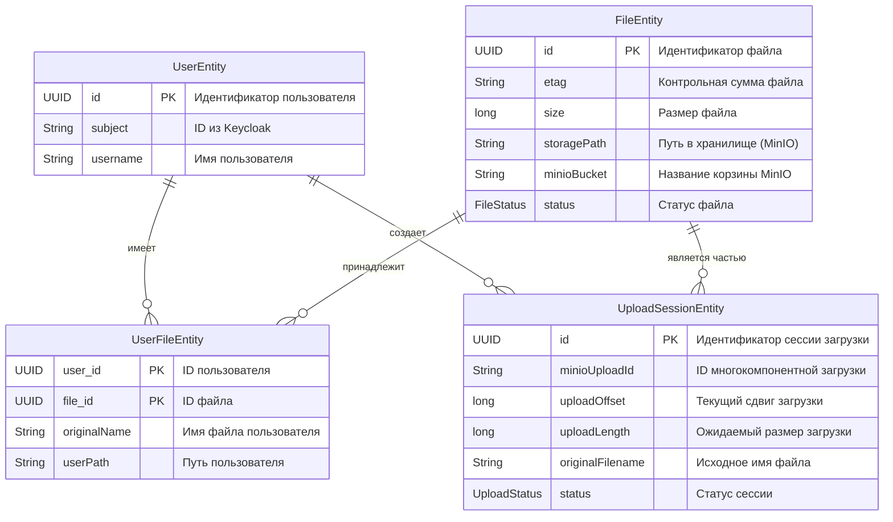
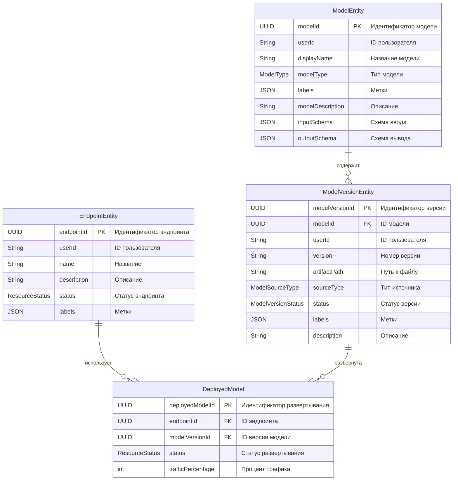

### **4. Модель данных**

#### **4.1. Модель данных для Artifact Store**

Этот сервис отвечает за управление файлами моделей и других артефактов. Его основная цель — надёжное и эффективное хранение.

  * **`UserEntity`**: Хранит основные данные о пользователе. Связь с `Keycloak` через поле `subject`.
  * **`FileEntity`**: Содержит метаданные о файле, такие как его физическое расположение, размер и статус. Это позволяет хранить один и тот же файл для нескольких пользователей, не дублируя его.
  * **`UploadSessionEntity`**: Используется для управления процессом загрузки файлов. Эта сущность делает возможным возобновление загрузки, что очень важно для больших файлов.
  * **`UserFileEntity`**: Связующая таблица между пользователями и файлами. Она позволяет одному файлу иметь несколько владельцев и хранит уникальные для каждого пользователя метаданные, такие как оригинальное имя файла.

#### **4.2. Модель данных для Model Registry**

Этот сервис управляет жизненным циклом моделей, их версиями и развертыванием.

  * **`ModelEntity`**: Представляет логическую модель. Она объединяет все версии одной модели.
  * **`ModelVersionEntity`**: Хранит метаданные каждой конкретной версии модели. Именно эта сущность привязана к физическому файлу (`artifactPath`).
  * **`EndpointEntity`**: Определяет эндпоинт, который служит точкой входа для инференс-запросов. Он содержит информацию о выделенных ресурсах.
  * **`DeployedModel`**: Связующая таблица, которая позволяет привязать одну или несколько версий модели к одному эндпоинту. Это делает возможными сценарии вроде **канареечных релизов**, когда трафик распределяется между разными версиями.
