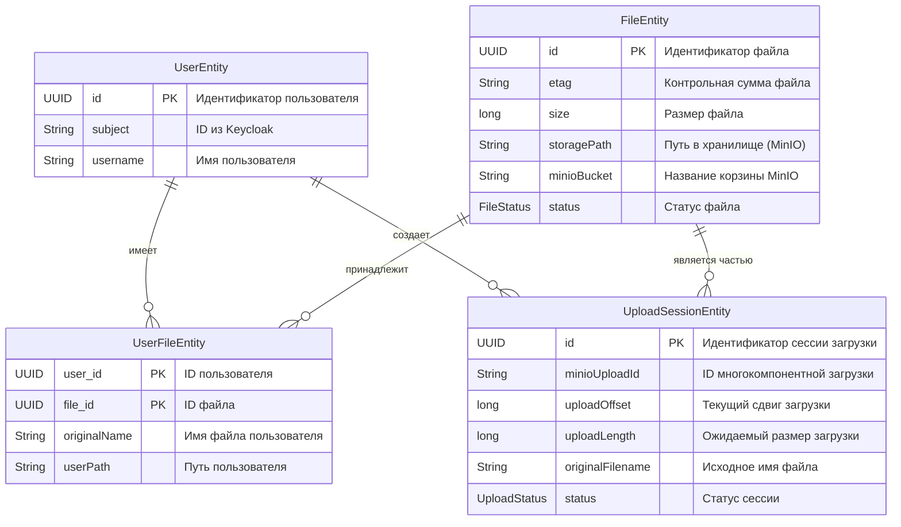

Вот как выглядит структура сущностей:

**1. `UserEntity` (Пользователь)**
* **Назначение:** Хранит информацию о пользователях, которые работают с платформой. Это центральная сущность.
* **Атрибуты:** `id` (UUID), `subject` (уникальный ID из Keycloak), `username`, `createdAt`.
* **Связи:** Связан с `UploadSessionEntity` и `UserFileEntity` (один пользователь может иметь множество сессий загрузки и файлов).

**2. `FileEntity` (Файл)**
* **Назначение:** Представляет физический файл, который был загружен в хранилище.
* **Атрибуты:** `id` (UUID), `etag`, `size`, `storagePath`, `minioBucket`, `status`, `createdAt`, `updatedAt`.
* **Связи:** Связан с `UserFileEntity` и `UploadSessionEntity` (один файл может принадлежать нескольким пользователям и быть частью нескольких сессий).

**3. `UploadSessionEntity` (Сессия загрузки)**
* **Назначение:** Управляет процессом загрузки файла. Эта сущность реализует функционал, аналогичный протоколу `tus`, позволяя возобновлять загрузку.
* **Атрибуты:** `id` (UUID), `minioUploadId`, `uploadOffset`, `uploadLength`, `chunkSize`, `originalFilename`, `partEtags` (Map), `expectedEtag`, `status`, `createdAt`, `updatedAt`.
* **Связи:** Связан с `UserEntity` и `FileEntity` (одна сессия принадлежит одному пользователю и одному файлу).

**4. `UserFileEntity` (Связующая сущность Пользователь-Файл)**
* **Назначение:** Эта сущность связывает `User` и `File`, позволяя одному файлу иметь несколько владельцев.
* **Атрибуты:** `user` (ID), `file` (ID), `originalName`, `createdAt`, `uploadedAt`, `deletedAt`, `userPath`.
* **Связи:** Реализует связь "многие-ко-многим" между `UserEntity` и `FileEntity`. Это очень гибкое решение, так как один и тот же файл может быть загружен разными пользователями, но физически храниться в единственном экземпляре.
