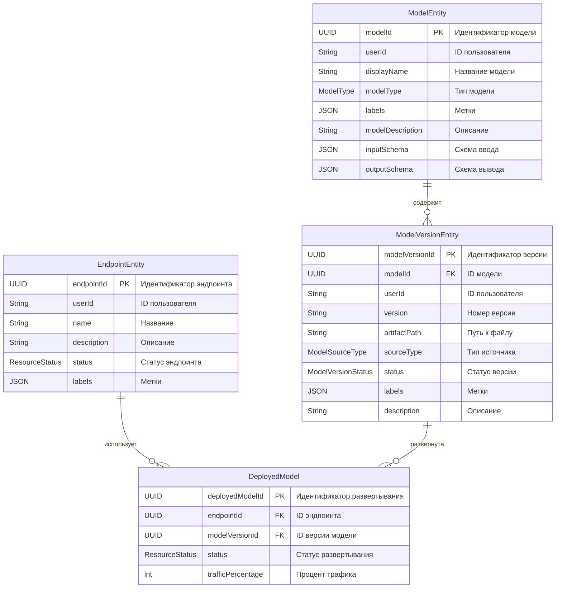

### **Сущности Model Registry**

  * **`EndpointEntity`**

      * **Назначение:** Представляет логический **эндпоинт** (URI), через который пользователи обращаются к моделям для инференса.
      * **Атрибуты:** `endpointId` (UUID, PK), `userId` (ID пользователя), `name`, `status`, `description`, `resources` (встраиваемый объект с CPU, Memory, GPU), `createdAt`, `updatedAt`, `deletedAt`, и `labels`.
      * **Связи:** Связан с `DeployedModel` (один эндпоинт может содержать несколько развёрнутых моделей).

  * **`ModelEntity`**

      * **Назначение:** Представляет саму логическую **модель** (например, "Модель для классификации изображений").
      * **Атрибуты:** `modelId` (UUID, PK), `userId`, `modelType`, `displayName`, `modelDescription`, `inputSchema`, `outputSchema`, `labels`, `createdAt`, `updatedAt`, `deletedAt`.
      * **Связи:** Связан с `ModelVersionEntity` (одна модель может иметь несколько версий).

  * **`ModelVersionEntity`**

      * **Назначение:** Хранит информацию о конкретной **версии** модели.
      * **Атрибуты:** `modelVersionId` (UUID, PK), `userId`, `version`, `artifactPath` (путь к файлу модели), `sourceType`, `status`, `description`, `labels`, `createdAt`, `updatedAt`, `deletedAt`.
      * **Связи:** Связан с `ModelEntity` (одна версия принадлежит одной модели) и с `DeployedModel` (одна версия может быть развёрнута на нескольких эндпоинтах).

  * **`DeployedModel`**

      * **Назначение:** Это **связующая сущность**, которая реализует связь "многие-ко-многим" между эндпоинтами и версиями моделей. Она также хранит специфическую информацию о развёртывании, такую как процент трафика.
      * **Атрибуты:** `deployedModelId` (UUID, PK), `trafficPercentage`, `status`, `createdAt`, `updatedAt`.
      * **Связи:** Связан с `EndpointEntity` и `ModelVersionEntity`.

-----

