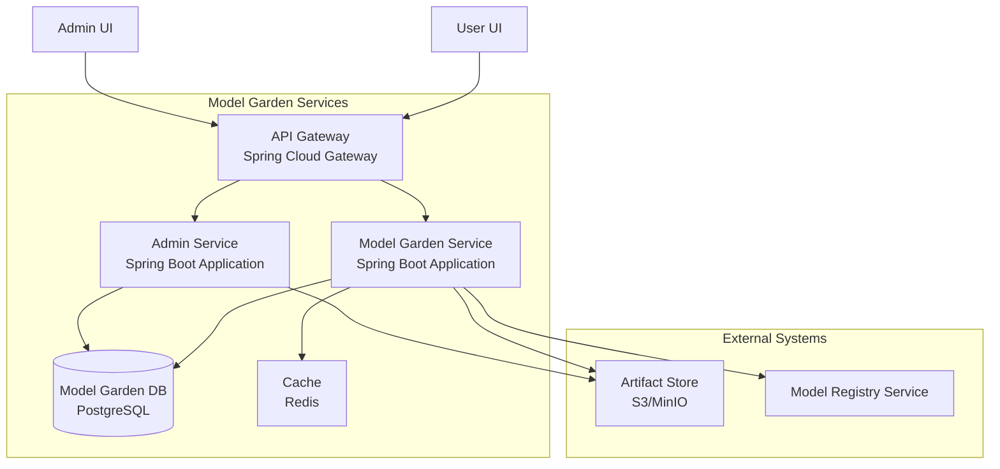
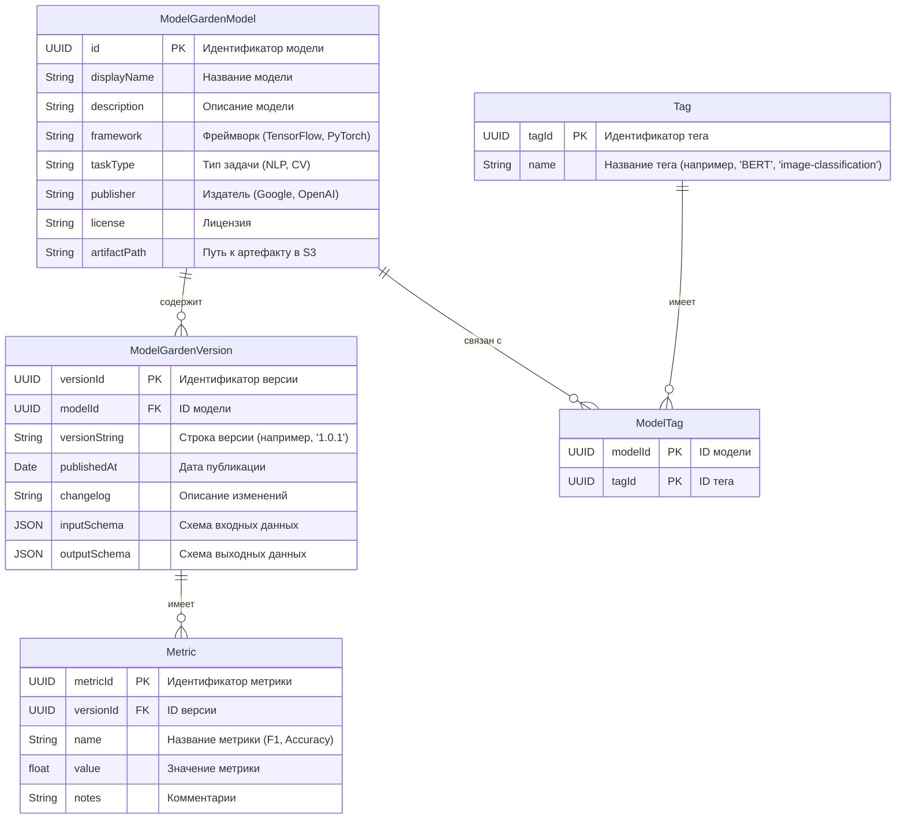

## Model Garden

Цель сервиса: Ускорить работу, предоставить проверенные модели, централизовать каталог и, возможно, монетизировать платформу.

Функционал: Поиск, фильтрация, детальные страницы, а также ключевой механизм "клонирования" (создание ссылки) в личное хранилище пользователя.

Архитектура: Сервис Model Garden будет отдельным микросервисом, который будет взаимодействовать с уже существующими сервисами Model Registry и Artifact Store. При этом он будет хранить только метаданные моделей, а не сами файлы, что критически важно.

Управление: Ты уточнил, что администратор будет отвечать за публикацию моделей и их проверку.

Взаимодействие с другими сервисами

- Интеграция с Model Registry: Когда пользователь "клонирует" модель из Model Garden, на самом деле это означает, что в базе данных Model Registry создаётся новая запись, которая просто ссылается на уже существующий артефакт в Artifact Store. Это очень важно, потому что мы не дублируем файлы, а просто создаём метаданные, что экономит место и ресурсы.

- Запросы к Artifact Store: Когда пользователь или Triton Runtime запрашивают файл модели, они обращаются к Artifact Store с помощью artifactPath. Artifact Store должен быть настроен так, чтобы он мог выдавать доступ к файлам, на которые ссылаются модели из Model Garden.

- Взаимодействие с системным администратором: Процесс публикации модели в Model Garden будет происходить через отдельный внутренний API. Администратор сначала загружает файл модели в Artifact Store, затем регистрирует её в своём личном реестре Model Registry, а уже потом, через специальный API, публикует её в Model Garden.
- 
---

### 1. Назначение и цель

**Основная цель:** Model Garden — это **каталог готовых к использованию ML-моделей**. Он решает несколько ключевых проблем:

1.  **Ускорение Time-to-Market:** Разработчики и data scientist'ы не всегда могут или хотят обучать модели с нуля. Они могут найти предобученную модель (например, BERT для NLP, ResNet для компьютерного зрения), дообучить её (fine-tune) на своих данных или использовать сразу для инференса, экономя недели или месяцы работы.
2.  **Гарантия качества и совместимости:** Модели в каталоге проверены, протестированы и сертифицированы вашей платформой. Пользователь уверен, что модель запустится в его среде, не вызовет конфликтов зависимостей и покажет заявленное качество.
3.  **Централизация и обнаружение:** Без такого каталога модели разбросаны по разным командам, дублируются, их метаданные теряются. Model Garden становится единым источником истины о доступных в компании моделях.
4.  **Бизнес-ценность:** Вы можете monetize платформу, предлагая платные модели (как SaaS) или модели, обученные на премиальных данных.

**Зачем он, если можно загружать свои?** Это два разных сценария:
*   **Model Registry:** Ваше личное рабочее пространство для *ваших* моделей, экспериментальных или продакшен-версий.
*   **Model Garden:** Публичный каталог *готовых решений* (как от вашей платформы, так и от сообщества/партнёров), которые можно взять и использовать. Аналог AppStore для моделей.

---

### 2. Основная функциональность

#### Просмотр и обнаружение (Discovery)

Пользовательский интерфейс должен включать:
*   **Поиск и фильтрация:** По названию, фреймворку (TensorFlow, PyTorch, Scikit-learn), типу задачи (классификация, регрессия, генерация текста), тегам, издателю (ваша компания, партнёр X).
*   **Детальная страница модели:**
    *   **Метаданные:** Название, версия, издатель, фреймворк, версия фреймворка, тип задачи, дата публикации, лицензия.
    *   **Описание:** Детальное описание модели, её возможностей, ограничений, пример использования.
    *   **Характеристики:** Точность, F1-score, latency на эталонном железе — чтобы можно было сравнить модели.
    *   **Входные/выходные данные:** Схема (например, JSON Schema), пример запроса и ответа.
    *   **Ссылки:** Документация, паспорт модели (model card), учебные пособия.

#### Использование (Consumption)

Механизм должен быть простым и однозначным. 
Предлагаю двухэтапный процесс:
1.  **"Развернуть" (Deploy) или "Клонировать" (Clone):** Пользователь нажимает кнопку на странице модели. Это не клонирование кода, а создание *ссылки* на конкретную версию этой модели в его личном **Model Registry**.
2.  **Работа через Model Registry:** Далее пользователь управляет жизненным циклом этой модели (создание эндпоинта, мониторинг, версионирование) через стандартный интерфейс **Model Registry**, как если бы это была его собственная модель. Это ключевой момент — не изобретать велосипед для деплоя, а использовать существующий сервис.

---

### 3. Управление и архитектура

#### Управление моделями и правами

*   **Роли:**
    *   **Администратор:** публикует модели в Model Garden и управляет категориями и тегами, имеет право удалять модели.
*   **Процесс добавления модели (набросок workflow):**
    1.  Администратор загружает модель в **Artifact Store** (например, S3-совместимое хранилище) и регистрирует её в своём личном **Model Registry**.
    2.  Через UI или API администратор инициирует процесс публикации в Model Garden, указывая все необходимые метаданные.
    3.  Администратор проверяет модель, её метаданные, запускает автоматические тесты (валидация артефакта, проверка на уязвимости, бенчмаркинг).
    4.  После одобрения метаданные модели записываются в каталог, а сама модель помечается как "публичная" в **Artifact Store** и **Model Registry**. Сами файлы *не копируются*, это важно.

#### Высокоуровневая архитектура (микросервисы на Java)

1.  **Model Garden Service (Основной сервис):**
    *   **Ядро системы.** Отвечает за поиск, просмотр, "клонирование" моделей.
    *   **Слой доступа к данным (Repository):** Работает с базой `Model Garden DB` (лучше использовать реляционную БД, например **PostgreSQL**, для сложных запросов с фильтрами).
    *   **Кеширование:** Для часто запрашиваемых данных (топ-моделей, списка категорий) чтобы снизить нагрузку на БД.
    *   **Взаимодействие с внешними сервисами:**
        *   **Model Registry Service:** Вызывает его REST API для изменения статуса модели на "публичная" и для операции "клонирования" (создания ссылки в личном реестре пользователя).
        *   **Artifact Store:** Не управляет файлами, а только хранит в своей БД **ссылку (URI)** на артефакт (например, `s3://my-artifact-store-bucket/model-id/version/v1/`). Пресigned URL для скачивания может генерироваться через клиент S3.
2.  **Model Garden DB (PostgreSQL):** Хранит только **метаданные** моделей и информацию для каталога:
    *   Таблицы: `models`, `model_versions`, `publishers`, `categories`, `tags`, `deployment_stats`.
3.  **Внешние зависимости:**
    *   **Model Registry Service:** Существующий сервис вашей платформы.
    *   **Artifact Store:** S3, MinIo и  т.д.

### Следующие шаги для реализации:

1.  **Определить API контракты (REST):**
    *   `GET /api/v1/models?framework=tensorflow&task=classification`
    *   `GET /api/v1/models/{modelId}`
    *   `POST /api/v1/models/{modelId}/versions/{versionId}/clone` (создаёт ссылку в личном Registry)
    *   `POST /api/internal/models/{modelId}/publish` (для админов)
2.  **Продумать безопасность:** OAuth2/Keycloak для аутентификации и авторизации .
3.  **Проектирование БД:** Нарисовать детальную ER-диаграмму.
4.  **Настроить CI/CD:** Для сборки, тестирования и развёртывания микросервисов.

TODO : 

Отличная инициатива! Создание сервиса, аналогичного Vertex AI Model Garden, — это комплексная, но очень интересная задача. Давайте детально спроектируем его, как это сделали бы два инженера у доски.

Как ИИ-ассистент, я обладаю знаниями о принципах работы облачных ML-платформ (таких как Vertex AI, SageMaker, Azure ML), архитектуре микросервисов, паттернах проектирования (API Gateway, Service Discovery), практиках MLOps и, конечно, экосистеме Java/Spring. Я помогу вам структурировать проект и предложу технические решения.

Давайте разложим проект по вашим пунктам.

---

### 1. Назначение и цель

**Основная цель:** Model Garden — это **каталог готовых к использованию ML-моделей**. Он решает несколько ключевых проблем:

1.  **Ускорение Time-to-Market:** Разработчики и data scientist'ы не всегда могут или хотят обучать модели с нуля. Они могут найти предобученную модель (например, BERT для NLP, ResNet для компьютерного зрения), дообучить её (fine-tune) на своих данных или использовать сразу для инференса, экономя недели или месяцы работы.
2.  **Гарантия качества и совместимости:** Модели в каталоге проверены, протестированы и сертифицированы вашей платформой. Пользователь уверен, что модель запустится в его среде, не вызовет конфликтов зависимостей и покажет заявленное качество.
3.  **Централизация и обнаружение:** Без такого каталога модели разбросаны по разным командам, дублируются, их метаданные теряются. Model Garden становится единым источником истины о доступных в компании моделях.
4.  **Бизнес-ценность:** Вы можете monetize платформу, предлагая платные модели (как SaaS) или модели, обученные на премиальных данных.

**Зачем он, если можно загружать свои?** Это два разных сценария:
*   **Model Registry:** Ваше личное рабочее пространство для *ваших* моделей, экспериментальных или продакшен-версий.
*   **Model Garden:** Публичный каталог *готовых решений* (как от вашей платформы, так и от сообщества/партнёров), которые можно взять и использовать. Аналог AppStore для моделей.

---

### 2. Основная функциональность

#### Просмотр и обнаружение (Discovery)

Пользовательский интерфейс должен включать:
*   **Поиск и фильтрация:** По названию, фреймворку (TensorFlow, PyTorch, Scikit-learn), типу задачи (классификация, регрессия, генерация текста), тегам, издателю (ваша компания, партнёр X).
*   **Детальная страница модели:**
    *   **Метаданные:** Название, версия, издатель, фреймворк, версия фреймворка, тип задачи, дата публикации, лицензия.
    *   **Описание:** Детальное описание модели, её возможностей, ограничений, пример использования.
    *   **Характеристики:** Точность, F1-score, latency на эталонном железе — чтобы можно было сравнить модели.
    *   **Входные/выходные данные:** Схема (например, JSON Schema), пример запроса и ответа.
    *   **Стоимость:** Если модель платная (стоимость инференса за 1000 запросов).
    *   **Ссылки:** Документация, паспорт модели (model card), учебные пособия.

#### Использование (Consumption)

Механизм должен быть простым и однозначным. Предлагаю двухэтапный процесс:
1.  **"Развернуть" (Deploy) или "Клонировать" (Clone):** Пользователь нажимает кнопку на странице модели. Это не клонирование кода, а создание *ссылки* на конкретную версию этой модели в его личном **Model Registry**.
2.  **Работа через Model Registry:** Далее пользователь управляет жизненным циклом этой модели (создание эндпоинта, мониторинг, версионирование) через стандартный интерфейс **Model Registry**, как если бы это была его собственная модель. Это ключевой момент — не изобретать велосипед для деплоя, а использовать существующий сервис.

**Альтернатива для продвинутых пользователей:** Предоставлять код snippets для прямого вызова API инференса (если модель уже развёрнута как сервис платформой) или команды CLI для скачивания артефактов.

---

### 3. Управление и архитектура

#### Управление моделями и правами

*   **Роли:**
    *   **Администратор:** Утверждает заявки на публикацию, управляет категориями и тегами, имеет право удалять модели.
    *   **Издатель (Publisher):** Внутренние команды ML-инженеров или партнёры. Они могут подать заявку на добавление новой модели или новой версии существующей в каталог.
*   **Процесс добавления модели (набросок workflow):**
    1.  Издатель загружает модель в **Artifact Store** (например, S3-совместимое хранилище) и регистрирует её в своём личном **Model Registry**.
    2.  Через UI или API издатель инициирует процесс публикации в Model Garden, указывая все необходимые метаданные.
    3.  Заявка попадает в очередь на модерацию (можно использовать отдельную БД или систему тикетов).
    4.  Администратор проверяет модель, её метаданные, запускает автоматические тесты (валидация артефакта, проверка на уязвимости, бенчмаркинг).
    5.  После одобрения метаданные модели записываются в каталог, а сама модель помечается как "публичная" в **Artifact Store** и **Model Registry**. Сами файлы *не копируются*, это важно.

#### Высокоуровневая архитектура (микросервисы на Java/Spring)

Давайте представим это в виде схемы:

**Пояснение к схеме и компонентам:**

1.  **API Gateway (Spring Cloud Gateway):** Единая точка входа. Обрабатывает аутентификацию, маршрутизацию, rate limiting.
2.  **Model Garden Service (Основной сервис, Spring Boot):**
    *   **Ядро системы.** Отвечает за поиск, просмотр, "клонирование" моделей.
    *   **Слой доступа к данным (Repository):** Работает с базой `Model Garden DB` (лучше использовать реляционную БД, например **PostgreSQL**, для сложных запросов с фильтрами).
    *   **Кеширование (Redis):** Для часто запрашиваемых данных (топ-моделей, списка категорий) чтобы снизить нагрузку на БД.
    *   **Взаимодействие с внешними сервисами:**
        *   **Model Registry Service:** Вызывает его REST API для изменения статуса модели на "публичная" и для операции "клонирования" (создания ссылки в личном реестре пользователя).
        *   **Artifact Store:** Не управляет файлами, а только хранит в своей БД **ссылку (URI)** на артефакт (например, `s3://my-artifact-store-bucket/model-id/version/v1/`). Пресigned URL для скачивания может генерироваться через клиент S3.
3.  **Admin Service (Optional, можно совместить с основным):** Отдельный сервис для административных задач: модерация заявок, управление тегами и категориями.
4.  **Model Garden DB (PostgreSQL):** Хранит только **метаданные** моделей и информацию для каталога:
    *   Таблицы: `models`, `model_versions`, `publishers`, `categories`, `tags`, `deployment_stats`.
5.  **Внешние зависимости:**
    *   **Model Registry Service:** Существующий сервис вашей платформы.
    *   **Artifact Store:** S3, MinIO, Google Cloud Storage и т.д.

### Следующие шаги для реализации:

1.  **Определить API контракты (REST):**
    *   `GET /api/v1/models?framework=tensorflow&task=classification`
    *   `GET /api/v1/models/{modelId}`
    *   `POST /api/v1/models/{modelId}/versions/{versionId}/clone` (создаёт ссылку в личном Registry)
    *   `POST /api/internal/models/{modelId}/publish` (для издателей)
    *   `PUT /api/internal/models/{modelId}/approve` (для админов)
2.  **Продумать безопасность:** OAuth2/Keycloak для аутентификации и авторизации (роли `USER`, `PUBLISHER`, `ADMIN`).
3.  **Выбрать технологии:** Spring Boot 3, Spring Data JPA (Hibernate), Spring Security, Feign Client для вызова Model Registry API, S3 SDK для работы с Artifact Store.
4.  **Проектирование БД:** Нарисовать детальную ER-диаграмму.
5.  **Настроить CI/CD:** Для сборки, тестирования и развёртывания микросервисов.

Это прочный фундамент для начала проекта. Что бы вы хотели детализировать в первую очередь?

### **9. Модель данных для Model Garden**

Сервис **Model Garden** будет иметь свою собственную базу данных, которая хранит только метаданные моделей. Это критически важно для производительности поиска и фильтрации. Сами файлы моделей будут храниться в **Artifact Store**, а в этой базе данных мы будем хранить только ссылки на них.

  * **`ModelGardenModel`**: Представляет собой сущность модели в каталоге. Содержит общие метаданные, такие как имя, описание, фреймворк и тип задачи.
  * **`ModelGardenVersion`**: Хранит информацию о конкретной версии модели. Это включает строку версии, дату публикации и схему данных, что критически важно для проверки валидности запросов.
  * **`Metric`**: Позволяет хранить ключевые метрики производительности (например, F1-score, точность). Это даёт пользователям возможность сравнивать модели.
  * **`Tag` и `ModelTag`**: Эти таблицы реализуют отношения **многие-ко-многим**, позволяя присваивать одной модели несколько тегов (например, `NLP` и `fast-inference`), что облегчает поиск.

Эта модель данных достаточно гибкая и масштабируемая для всех сценариев, которые ты описал.

-----

### **9.1. API-контракты (REST)**

Мы определим API, которые позволят фронтенду и другим сервисам взаимодействовать с Model Garden.

| **HTTP Метод** | **URI**                                        | **Описание**                                                                              | **Роль**               |
| :------------- | :--------------------------------------------- | :---------------------------------------------------------------------------------------- | :--------------------- |
| `GET`          | `/models`                                      | Получить список всех моделей с возможностью фильтрации по фреймворку, тегу и типу задачи. | `Authenticated User`   |
| `GET`          | `/models/{modelId}`                            | Получить детальную информацию о конкретной модели и её версиях.                           | `Authenticated User`   |
| `POST`         | `/models/{modelId}/versions/{versionId}/clone` | Клонировать версию модели в личный реестр пользователя.                                   | `Data Scientist`       |
| `POST`         | `/admin/models`                                | **(Только для администраторов)** Опубликовать новую модель в Model Garden.                | `System Administrator` |
| `PUT`          | `/admin/models/{modelId}`                      | **(Только для администраторов)** Обновить метаданные модели.                              | `System Administrator` |
| `DELETE`       | `/admin/models/{modelId}`                      | **(Только для администраторов)** Удалить модель из Model Garden.                          | `System Administrator` |

Мы спроектировали ключевые компоненты нового сервиса. Можем ли мы считать эту часть завершённой?